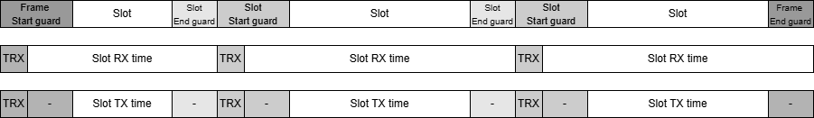
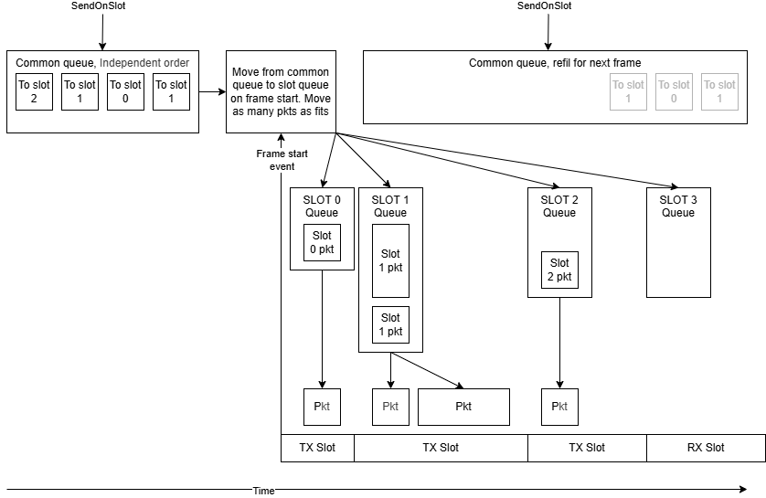
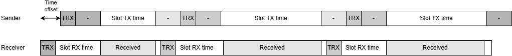
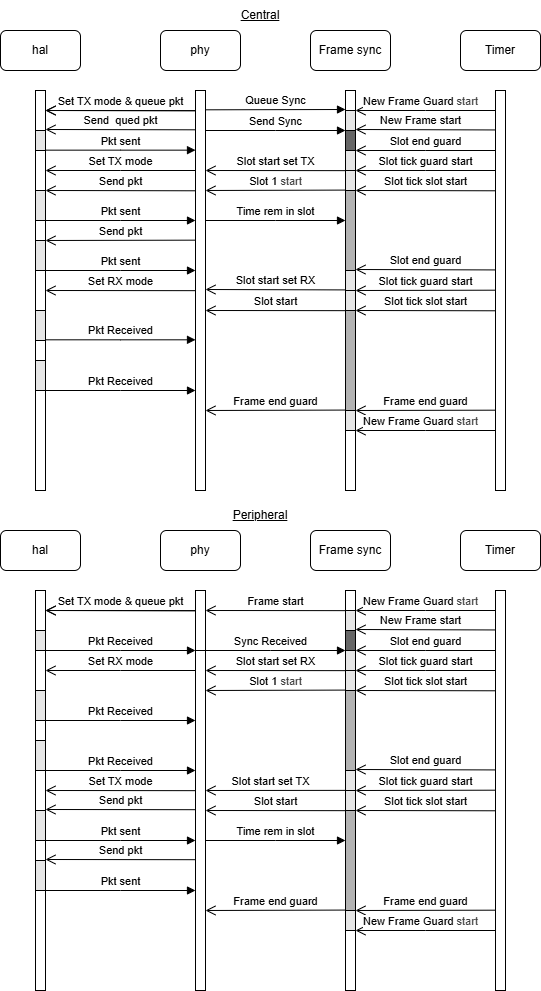

## Frame structure
Below follows an example of how a frame might look with three configured slots. It shows the same frame where the slots are either configured as TX or RX:
  
RX - Receive.  
TX - Transmit.  
TRX - Time where the radio switches between TX and RX.  
SLOT START GUARD - Buffer time that allows for imperfect synchronization.  
SLOT END GUARD -  Buffer time that allows for imperfect synchronization.  
  

  
## Packet Queueing
Below is a visualization of how packets are queued and moved from the common queue to the individual slot queues at frame start.
  

  
## Time synchronization
The time synchronization between two or more devices is based on detection of the SYNC message. When a sync message is detected the peripheral devices modify the lengths of their frames to catch up to or wait for the frame of the central device.
  

  
The time synchronization might not always be perfect. To manage this there is a built-in guard time that makes the RX time period slightly longer than the maximum allowed TX time. This makes it possible for a TX packet to drift within a RX slot without loss of communication. Below is a very exaggerated visualization of this.
  

## HAL and Timer details
Below is a detailed sequence diagram that describes function calls during operation. The details might differ slightly between the implementation and the diagram, but the important flow of operations is visualized.
  
